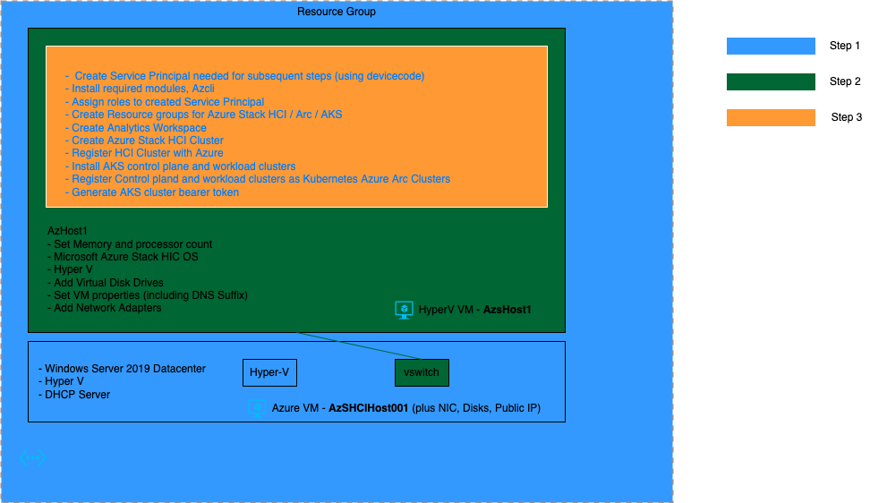
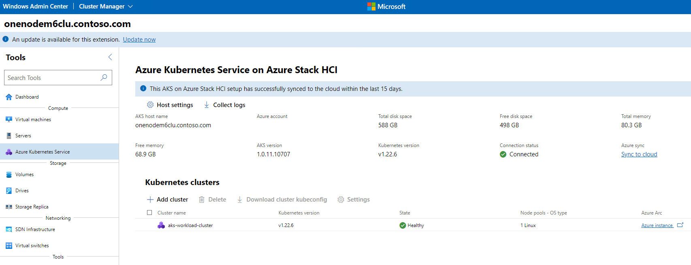

# Purpose of this fork was to tweak the original repository scripts to create a single node HCI cluster for testing purposes only

## What do the scripts do?

The templates / scripts are executed in a sequence of 3 steps. At the end of step 3 we get a Virtual Single node HCI cluster (non domain joined) which is registed to Azure. Additionaly we get control plane and workload AKS clusters created on the HCI cluster, and registered as Kubernetes Azure Arc Clusters.

## Overview of steps




Step 1 creates the Azure resources including the Azure VM with Windows Server 2019, Hyper-V, and DHCP server.  Step 2 creates a nested Hyper-V VM with HCI OS, Hyper-V, and sets up the properties, disks and networking needed for Step 3. Step 3 does the creation and registration of the Azure Stack HCI cluster, followed by the creation of control plane and workload AKS clusters (on the Azure Stack HCI), along with their Azure Registration.

## Details of Steps

### Step 1

Go to the Root of this repo, click on deploy to Azure, add value of required parameters, and start the deployment.    This will create an Azure VM will all required windows features enabled and prequisites created to setup nested HCI VM (AzSHCIHost001). This step will take over 30 minutes
  
### Step 2

Once step 1 is complete, RDP into the created VM. Next if we want we can directly execute the powershell script [New-AzSHCISandbox.ps1](./Sandbox/New-AzSHCISandbox.ps1) using the desktop shortcut, to initiate step 2 with default configurations. This script creates a nested Hyper-V VM/node (AzsHost1) with HCI OS, with windows features like HyperV enabled, and sets properties, disks and networking needed for subsequent steps. This step takes around 15 minutes to complete.

You may choose to modify some configuration values associated with this script prior to executing this script. This script and its configuration file AzSHCISandbox-Config.psd1 are located at the path **C:\AzHCI_Sandbox\AzSHCISandbox-main** . Some of these configurations include:

* NestedVMMemoryinGB: This is the RAM that will be allocated to the HCI cluster node. The minimum recommended value for this is 64GB. By default this value is set to 80GB
* SDNDomainFQDN: This is the domain suffix which will get associated with the HCI cluster node. By default this is set to "contoso.com". Even for a single node non domain joined cluster, this needs to be set.
* SDNAdminPassword: This is the Administrator password for the created HyperV VM AzsHost1. This will be needed in step 3, and also if you use Windows Admin Center to add / manage the HCI Cluster created in step 3.
  
### Step 3

For this step, we need to get a powershell session into the nested HyperV VM AzsHost1. To do this open the HyperV manager, and connect to the nested VM, you will be prompted to enter the username and password. Once you are at the powershell prompt, you need to and create a copy of the [config.txt](./Sandbox/SingleNodeHCIClusterCreationAndRegistration/config.txt), [progress.log](./Sandbox/SingleNodeHCIClusterCreationAndRegistration/progress.log) and [OneNode.ps1](./Sandbox/SingleNodeHCIClusterCreationAndRegistration/OneNode.ps1) files in the nested VM. One way is to create new files using nodepad and copy the content over. After copying the config.txt file you will need to have a look at the configurations in the config.txt file and modify configurations as appropriate. Overview of configuration values can be found [here](https://github.com/microsoft/onenode-edge-poc/blob/Adding-Domain-Version/OneNode-NoDomain-Readme/OneNode-NoDomain.md#step-2-set-up-the-deployment-tool). Some key configuration values which you should particularly know about are:

* spnDisplayName: This is the display name of the service principal which is created by the OneNode.ps1 script
* resourceGroup : This resource group is created in the Azure Subscription and resources like Azure Stack HCI, and Kubernetes Arc clusters are created here
* subscriptionId: You need to modify this to your subscription id
* tenantId: You need to modify this to your tenatnt id
* hciClusterIp: By default the value of this is 192.168.0.4. If you want to use Windows Admin Center to manage your HCI cluster from the Azure VM you will need this ip, see section below to setup Windows Admin Center
* aksNodeIpPoolStart and aksNodeIpPoolEnd : The HCI VMs which get created when creating the control plane and workload clusters (6 in all), pick up ips from this range

It is also useful to have a look at the progress.log file, which shows the sequence of steps followed by the script and their status.

After required modifications have been made to config.txt file, execute the OneNode.ps1 script as follows

```
    & .\OneNode.ps1
```

In the step where the service principal gets created, you will need to login in to your Azure Subscript once, after which the service principal is appended to the config.txt and used from there in the subsequent steps. Manual intervention is also need to confirm the nested VM restart, however you **do not** need to execute the script manually again

The script generates files like .kube/config on the node, and you can directly fire kubectl commands from the powershell session once th script execution has completed. It is also worth noting that the script generates the file **ArcServiceToken.txt** which contains the token if you want to manage your kubernetes workloads from Azure (see Adding Arc token in Azure section)

### Accessing HCI cluster from Windows Admin Center

Microsoft Edge and Windows Admin Center (WAC) are already installed on the Azure VM. In order to manage the Azure Stack HCI cluster from Admin center, you need to create an entry in the Azure VMs host file for the cluster, in the form clusterName.domain, so with default settings the entry in the hosts file should be "192.168.0.4 OneNodeM5Clu.contoso.com".

Once this entry has been made, open WAC. To do this open edge and navigate to https://azshcihost001. Next click on Add and then on Server cluster. Next enter the name of the HCI Cluster **OneNodeM5Clu.contoso.com**. You will be asked add the username (Administrator) and password (from step 2), do that, and with that you should now be able to manage the HCI cluster. Following are some of the screen shots:

*  HCI Cluster VMs: 
*  HCI Manage AKS cluster: 
   
   As we can see 6 HCI VMs are created for the control plane and workload AKS clusters

### Adding Arc token in Azure

If you navigate to the Azure resource group (based on subscription id, and resource group you provided in step 3), and you should see several resources under it, including Azure Stack HCI, Kubernetes Azure Arc clusters (control plane and workload clusters). Navigate to the workload AKS cluster. If you then navigate to workloads under resources you are asked to enter the Arc Token. You can get the token from the ArcServiceToken.txt file (see step 3). After you add the token, all resource section links including workloads, namespaces, etc will start working. Some screenshorts

* Resource group resources: 
* Adding Arc token: 

After this we can even connect to the Kubernetes cluster locally using the Arc token. The command below creates a proxy and a corresponding entry in your local kube config file, after which you will be able to run kubectl commands against the Arc workload cluster.

```bash
# you will need to modify the RG name based on your configuration in config.txt
az connectedk8s proxy -n aks-workload-cluster -g OneNodeM5Rg --token $tok
```

## Get Started with Step 1: Deploy to Azure

[](https://portal.azure.com/#create/Microsoft.Template/uri/https%3A%2F%2Fraw.githubusercontent.com%2FmaniSbindra%2FAzStackHCISandbox%2Fmain%2Fjson%2Fazuredeploy.json)


## Backlog / Issues

* Currently manual triggers are need to invoke the 3 steps. Stragegy needs to be be designed to minimize the number of manual triggers, this would potentially involve securely passing in Service Principal securely to the nested HyperV VM
* Further clean up of New-AzSHCISandbox.ps1 and its configuration file AzSHCISandbox-Config.psd1 needs to be done to remove redundant code and configurations
* Consolidate the current multiple config files for the 3 steps into a single one
